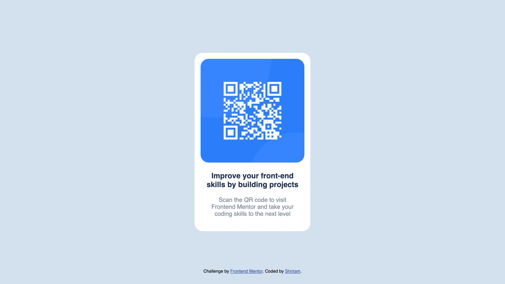

# Frontend Mentor - QR code component solution

This is a solution to the [QR code component challenge on Frontend Mentor](https://www.frontendmentor.io/challenges/qr-code-component-iux_sIO_H). Frontend Mentor challenges help you improve your coding skills by building realistic projects. 

## Table of contents

- [Overview](#overview)
  - [Screenshot](#screenshot)
  - [Links](#links)
  - [Built with](#built-with)
  - [What I learned](#what-i-learned)
  - [Useful resources](#useful-resources)
- [Author](#author)

## Overview

### Screenshot

### Links

- Solution URL: [solution](https://your-solution-url.com)

### Built with

- Semantic HTML5 markup
- CSS custom properties
- Flexbox

### What I learned

here I learned how to put image in place, and I made use of flex box to center the card in the body and to center all images and card description in center.

### Useful resources
 check out MDN to learn flexbox

## Author

- GitHub - [@RAM844](https://github.com/RAM844)
- Frontend Mentor - [@RAM844](https://www.frontendmentor.io/profile/RAM844)
- Twitter - [@ShriramBalaji7](https://www.twitter.com/ShriramBalaji7)

